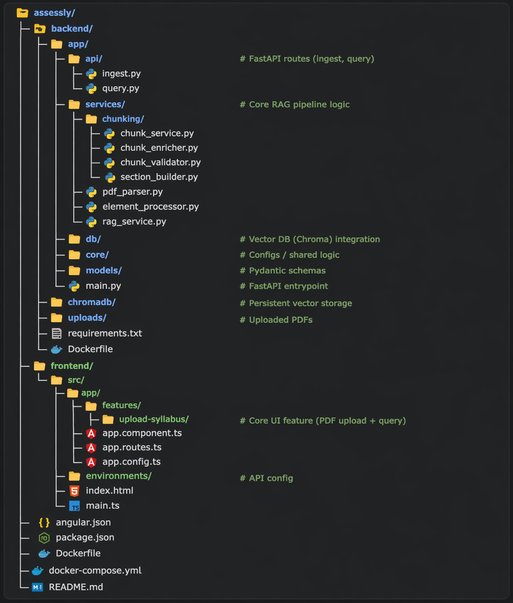

# 🧠 Assessly AI — RAG Knowledge Assistant

Assessly is a **Retrieval-Augmented Generation (RAG) powered Knowledge Assistant** that enables users to **upload documents and ask intelligent, context-aware questions**.

Built with a modern full-stack architecture, Assessly transforms static PDFs into **interactive knowledge systems** using semantic search and LLM-based reasoning.

---

## 🚀 Features

* 📄 Upload and process PDF documents
* 🧠 Context-aware question answering (RAG)
* 🔍 Semantic search with vector embeddings
* ⚡ Fast Angular-based UI
* 🧩 Modular backend (FastAPI + LangChain)
* 📊 Layout-aware PDF parsing (structure preserved)
* 🗂 Metadata-driven retrieval for traceability

---

## 🏗️ Tech Stack

### Frontend

* Angular 21
* TypeScript
* RxJS

### Backend

* FastAPI
* Python 3.11

### AI / RAG Pipeline

* LangChain (orchestration)
* ChromaDB (vector store)
* Ollama (LLM + embeddings)
* Nomic AI (`nomic-embed-text`)

### PDF Processing

* unstructured (layout-aware parsing)
* pdf2image + pytesseract (future OCR support)
* OpenCV, Pillow

---

## 🧠 RAG Pipeline Architecture

### ⚙️ Components

* 📄 **Chunking**
  Custom semantic + title-aware chunking using `unstructured.partition.pdf`
  Preserves document structure and context continuity

* 🧠 **Embeddings**
  Nomic AI (`nomic-embed-text`) via Ollama
  Optimized for high-quality semantic similarity

* 🗂 **Vector DB**
  ChromaDB with metadata filtering
  Enables efficient retrieval and traceability

* 🔍 **Retrieval**
  Top-K similarity search (cosine similarity)
  Hybrid ranking (vector + keyword) for improved relevance

* 🤖 **LLM (Generation)**
  Ollama (Mistral / LLaMA)
  Generates grounded answers from retrieved context

* 🧩 **Orchestration**
  LangChain pipeline for ingestion, retrieval, and response generation

---

## 🔄 Complete System Flow

```text
PDF Upload
   ↓
PDF Parsing (layout-aware)
   ↓
Element Processing & Cleaning
   ↓
Semantic Chunking (title-aware)
   ↓
Embedding Generation (nomic-embed-text)
   ↓
Vector Storage (ChromaDB)

───────────────

User Query
   ↓
Query Embedding
   ↓
Vector Search (ChromaDB)
   ↓
Hybrid Ranking (vector + keyword)
   ↓
Context Builder
   ↓
Prompt Template
   ↓
LLM (Mistral / LLaMA via Ollama)
   ↓
Final Answer
```

---

## 📄 PDF Processing Strategy

Assessly uses a **layout-aware parsing approach** to extract structured content:

```python
def parse_pdf(file_path: str):
    elements = partition_pdf(
        filename=file_path,
        strategy="hi_res",
        infer_table_structure=True,
        include_page_breaks=True,
        chunking_strategy=None,
    )
    return elements
```

### ✅ What We Extract

* Headings (Title-aware)
* Paragraphs (Narrative text)
* Lists
* Basic tables
* Page structure (for context preservation)

> 🚧 OCR (for scanned PDFs) is not enabled yet but planned in future releases.

---

## 📄 Supported PDF Types

### ✅ Recommended

* Digitally generated PDFs
* Text-based documents (copy/paste works)
* Structured reports with headings and paragraphs
* Educational materials (books, notes)

### ⚠️ Partial Support

* PDFs with simple tables
* Documents with limited images (non-critical)

### ❌ Not Recommended

* Scanned PDFs (image-based)
* Handwritten documents
* Image-heavy PDFs (charts/diagrams as core content)
* Complex multi-column layouts (research papers, magazines)
* Financial/complex tabular reports

> 💡 Tip: If you can **select text in the PDF**, Assessly will work best.

---

## 🎯 Accuracy Expectations

* 🟢 High → clean, structured PDFs
* 🟡 Moderate → mixed content (text + tables)
* 🔴 Limited → scanned or image-heavy PDFs

### 🚀 Upcoming Improvements

* OCR support
* Image & diagram understanding
* Advanced table parsing
* Layout intelligence

---

## 🏗️ Project Structure (Monorepo)

<p align="center">
  
</p>

---

## 🐳 Docker Setup

### Run Full Stack

```bash
docker-compose up --build
```

### Services

* Frontend → http://localhost:4200
* Backend → http://localhost:8000

---

## 🛠️ Manual Setup

### 1️⃣ Clone Repository

```bash
git clone https://github.com/your-username/assessly.git
cd assessly
```

---

### 2️⃣ Backend Setup

```bash
cd backend
python -m venv venv
venv\Scripts\activate

pip install -r requirements.txt
uvicorn app.main:app --reload
```

---

### 3️⃣ Frontend Setup

```bash
cd frontend
npm install
ng serve
```

---

### 🔗 Environment Config

Create:

```ts
src/environments/environment.ts
```

```ts
export const environment = {
  production: false,
  apiUrl: 'http://localhost:8000'
};
```

---

## 🧪 How to Use

1. Upload a supported PDF
2. Wait for processing
3. Ask a question
4. Get context-aware answers instantly

---

## 🔮 Roadmap

* [ ] OCR support (scanned PDFs)
* [ ] Image & diagram understanding
* [ ] Advanced chunking strategies
* [ ] Multi-document querying
* [ ] Authentication & user sessions
* [ ] Cloud deployment (AWS/GCP/Azure)
* [ ] SaaS multi-tenant architecture

---

## 💡 Vision

Assessly aims to become a **next-generation AI knowledge platform** that:

* Converts documents into intelligent systems
* Enables natural language querying
* Delivers accurate, explainable answers

---

## 👨‍💻 Author

**Imran Bahelim**
Lead Fullstack + AI Engineer | imrankhan.er01@gmail.com

---

## ⭐ Support

If you like this project, give it a ⭐ on GitHub!
