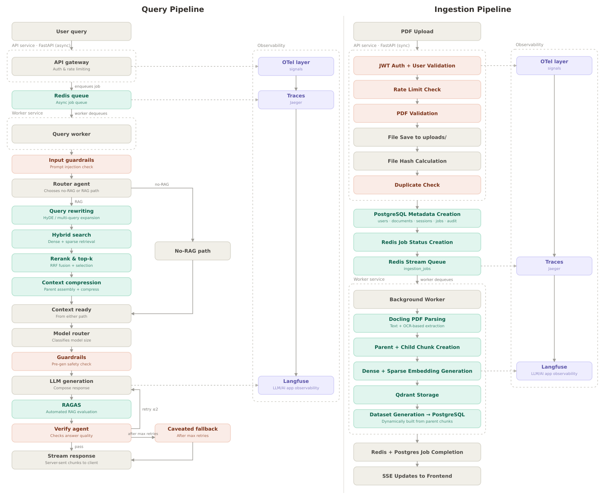

# 🧠 Assessly AI — Enterprise Agentic RAG Knowledge Assistant

Assessly AI is a production-oriented, **agentic** Retrieval-Augmented Generation (RAG) knowledge assistant that transforms PDFs into intelligent, searchable knowledge systems.

Users can upload documents, process them through a scalable AI pipeline, and ask grounded, context-aware questions using hybrid retrieval, query routing, and LLM-powered reasoning — with an automated verification agent checking every answer before it reaches the user.

Built with a modern full-stack architecture, Assessly focuses not only on AI capabilities — but also on the real engineering challenges involved in building production-grade, observable, multi-agent RAG systems.

🎥 Demo Video: https://www.linkedin.com/feed/update/urn:li:activity:7453663316465422337/

📈 **Result:** The agentic pipeline — query routing, hybrid retrieval, reranking, context compression, and RAGAS-based verification — improved grounded-answer accuracy by an estimated **~30–40%** over a naive single-pass RAG baseline.

<!-- ---

## 🏗️ Architecture Overview

 -->
---

## 🔄 Pipeline Architecture — Query + Ingestion

The diagram below shows both production pipelines end-to-end, including the agent layer, guardrails, and the observability stack that instruments every stage.



*(Diagram file included with this delivery — place it at `assets/pipelines_overview_combined.png` in the repo, or update the path above to wherever you host it.)*

---

## 🚀 Key Features

### 📄 Intelligent Document Processing

- Upload and process PDF documents
- Layout-aware, hierarchical document parsing (Docling)
- OCR support for scanned / image-heavy PDFs
- Semantic + section-aware chunking
- Parent-child chunk architecture
- Duplicate document detection (content hash based)
- Safe re-ingestion flow

### 🧠 Advanced Agentic RAG Pipeline

- **Router Agent** (query-intention identification) — dynamically chooses a **RAG** or **No-RAG** path per query
- **Query rewriting** (HyDE / multi-query expansion) on the RAG path
- Hybrid retrieval using dense (BGE-M3) + sparse (BM25) search
- **Reciprocal Rank Fusion (RRF)** + reranking
- Parent-context reconstruction with **context compression**
- Dynamic model routing based on query complexity
- Grounded answer generation
- User-isolated retrieval pipeline

### 🛡️ Guardrails & Verification

- **Input guardrails** — detect and block prompt-injection attempts before a query reaches retrieval
- **Pre-generation guardrails** — enforce safety and grounding policies before generation
- **Verify Agent (LLM-as-judge)** — evaluates every answer with **RAGAS** metrics (question, answer, full retrieved context) to check groundedness
- Automatic **regeneration retries (≤2)** on failed verification
- Graceful **caveated fallback** response after repeated verification failures

### 📊 Observability & Evaluation

- **OpenTelemetry** instrumentation across API and worker layers
- **Jaeger** for distributed tracing
- **Langfuse** for LLM/AI-specific observability (prompt/response inspection, latency, evaluation traces)
- **RAGAS**-based automated answer evaluation baked directly into the query pipeline

### ⚡ Production-Oriented Architecture

- Redis Streams job queues (ingestion + query)
- Background ingestion workers
- Background query workers
- SSE live progress streaming
- PostgreSQL metadata persistence
- Durable job tracking
- Multi-user isolation

### 🔐 Authentication & Security

- JWT authentication
- Refresh-token support
- Role-based access control (RBAC) and multi-tenant isolation
- Guest/demo mode
- Per-user document isolation
- Upload/query rate limiting
- LLM concurrency limiting

### 🏗️ Modern Full-Stack System

- Angular frontend
- FastAPI backend
- Qdrant vector database
- Redis infrastructure
- Docker Compose deployment
- Modular AI architecture

---

## 🧠 RAG Pipeline Architecture

Assessly uses a production-oriented, **agentic** Retrieval-Augmented Generation pipeline designed for large enterprise-style documents.

### ⚙️ Core Components

#### 📄 Document Parsing

Assessly uses layout-aware parsing to preserve:

- headings
- sections
- tables
- narrative structure
- contextual hierarchy

Current parsing stack:

- Docling (text-based + OCR-based extraction)
- PDF structural / hierarchical extraction
- Metadata enrichment

---

#### 🧩 Chunking Strategy

Assessly uses:

- semantic chunking
- section-aware chunking
- parent-child chunk architecture

This helps reduce context fragmentation and improves retrieval quality for long technical documents.

---

#### 🧠 Embeddings

Dense embeddings:

- `bge-m3`

Sparse retrieval:

- BM25 sparse vectors using FastEmbed

Embedding generation is configurable through Ollama-compatible APIs.

---

#### 🗂 Vector Database

Assessly uses Qdrant for:

- dense vector search
- sparse vector search
- hybrid retrieval
- metadata filtering
- parent-child storage architecture

Collections:

- `parent_chunks`
- `child_chunks`

---

#### 🤖 Multi-Agent Orchestration

Two agents sit around the core retrieval/generation flow:

**Router Agent (Query Intention Identification)**
- Classifies each incoming query as needing retrieval (**RAG**) or not (**No-RAG**)
- For the RAG path, rewrites the query (HyDE / multi-query expansion) before retrieval begins

**Verify Agent (LLM-as-judge)**
- Runs after generation, before the response is streamed to the user
- Scores the answer with **RAGAS** metrics, using `{question, answer, full retrieved context}` as input
- Checks groundedness/faithfulness of the generated answer against retrieved context
- Triggers up to **2 regeneration attempts** if verification fails
- Falls back to a clearly **caveated response** if the answer still fails verification after max retries

---

#### 🛡️ Guardrails

- **Input guardrails** — screen incoming queries for prompt-injection patterns before they reach the router/retrieval layer
- **Pre-generation guardrails** — a final safety/grounding check on the assembled context and prompt, immediately before LLM generation

---

#### 🤖 LLM Generation

Assessly currently supports Ollama-compatible local models.

Example models:

- `qwen2.5:7b`
- `qwen3:4b`
- `mistral`

The generation pipeline focuses on:

- grounded answers
- context-aware responses
- reduced hallucinations
- enterprise-style retrieval workflows
- automated post-generation verification (RAGAS) before delivery

---

#### 📈 Observability

Every stage of both pipelines is instrumented end-to-end:

- **OpenTelemetry** — traces and signals emitted from the API layer and background workers
- **Jaeger** — distributed trace visualization across the request/job lifecycle
- **Langfuse** — LLM/AI-specific observability: prompt/response inspection, generation latency, and evaluation traces (including RAGAS scores)

---

## ⚡ Production-Grade Engineering

One major goal of Assessly is exploring how real RAG systems are engineered beyond simple demo architectures.

### ✅ Implemented

#### Redis Streams Queue Architecture

- Ingestion job queues
- Query job queues
- Consumer groups
- Stale job recovery

#### Background Workers

- Asynchronous ingestion
- Asynchronous query execution
- Isolated worker processes

#### PostgreSQL Metadata Layer

Stores:

- users
- documents
- upload sessions
- ingestion jobs
- refresh tokens
- audit events

#### Multi-Agent Orchestration & Verification

- Router agent for RAG / No-RAG query classification
- Query rewriting on the RAG path
- RAGAS-based Verify Agent (LLM-as-judge) with retry and graceful fallback

#### Guardrails

- Input guardrails (prompt-injection detection)
- Pre-generation guardrails (safety / grounding checks)

#### Observability

- OpenTelemetry instrumentation
- Jaeger distributed tracing
- Langfuse LLM/AI observability

#### Multi-User Isolation

Isolation exists across:

- JWT identity
- API authorization
- Redis jobs
- PostgreSQL metadata
- Qdrant retrieval filters

#### SSE Live Streaming

Real-time streaming for:

- ingestion logs
- query progress
- worker status updates

#### Safe Re-Ingestion

Assessly prevents accidental data corruption:

- new vectors are inserted first
- old vectors are removed only after successful ingestion

#### Infrastructure Protection

- upload rate limiting
- query rate limiting
- LLM concurrency limiting
- upload size limits

---

## 🏗️ Tech Stack

### Frontend

- Angular 21
- TypeScript
- RxJS

### Backend

- FastAPI
- Python 3.11
- Uvicorn
- Gunicorn
- Pydantic

### AI / RAG Pipeline

- LangChain
- Ollama
- Qdrant
- FastEmbed
- `bge-m3` embeddings
- RAGAS (LLM-as-judge answer evaluation)

### Observability

- OpenTelemetry
- Jaeger
- Langfuse

### Infrastructure

- Redis
- Redis Streams
- PostgreSQL
- Docker Compose

### PDF Processing

- Docling
- Pillow
- OpenCV

### Authentication

- JWT access tokens
- Refresh-token cookies
- Passlib/Bcrypt

---

## 🔐 Authentication Flow

Supported flows:

- User registration
- Login
- JWT authentication
- Refresh tokens
- Guest/demo mode

Guest users:

- can use demo querying
- cannot upload private documents
- cannot delete documents

---

## 📡 API Endpoints

### Authentication

```text
POST /auth/register
POST /auth/login
POST /auth/guest
POST /auth/refresh
POST /auth/logout
GET  /auth/me
```

### Ingestion

```text
POST /ingest
GET  /ingest/jobs/{job_id}
GET  /ingest/stream/{job_id}
```

### Query

```text
POST /query
GET  /query/jobs/{query_job_id}
GET  /query/jobs/{query_job_id}/stream
```

### Knowledge Base

```text
GET    /knowledge-base/files
DELETE /knowledge-base/files/{document_id}
```

### Health

```text
GET /health/redis
GET /health/qdrant
GET /health/postgres
```

---

## 🐳 Docker Setup

### Development Infrastructure

```bash
docker compose up -d redis qdrant postgres worker query_worker
```

### Production-Style Stack

```bash
docker compose -f docker-compose.prod.yml up -d --build
```

### Useful Checks

```bash
docker compose ps
docker compose logs -f worker
docker compose logs -f query_worker
docker compose logs -f redis
docker compose logs -f qdrant
docker compose logs -f postgres
```

---

## 🛠️ Manual Setup

### 1️⃣ Clone Repository

```bash
git clone https://github.com/your-username/assessly.git
cd Assessly
```

### 2️⃣ Backend Setup

```bash
cd backend

python -m venv venv
venv\Scripts\activate

pip install -r requirements.txt

alembic upgrade head

uvicorn app.main:app --reload
```

Backend:

```text
http://localhost:8000
```

### 3️⃣ Frontend Setup

```bash
cd frontend

npm install
npm start
```

Frontend:

```text
http://localhost:4200
```

### 4️⃣ Model Runtime

Assessly expects an Ollama-compatible API configured by `OLLAMA_BASE_URL`.

Example local models:

```bash
ollama pull bge-m3
ollama pull qwen2.5:7b
```

---

## 🧪 How To Use

1. Register or log in
2. Upload a PDF
3. Watch ingestion progress live
4. Ask questions against your knowledge base
5. The router agent decides whether retrieval is needed, retrieves and verifies grounded context, and the verify agent checks the answer before it's streamed back
6. Receive grounded, verified AI-generated answers
7. View or delete your own knowledge-base files

Guest mode:

- Guest users can use demo/query flows
- Guest users cannot upload or delete private documents

---

## 📊 Production Readiness Status

Assessly has a strong production-grade architecture direction and several production-style foundations already implemented.

### ✅ Implemented Foundations

- Worker-based ingestion
- Worker-based querying
- Redis Streams architecture
- PostgreSQL metadata persistence
- Qdrant hybrid retrieval (dense + sparse, RRF fusion)
- Multi-agent orchestration (query routing + RAGAS-based verification)
- Input and pre-generation guardrails
- OpenTelemetry + Jaeger distributed tracing
- Langfuse LLM/AI observability
- JWT authentication
- Multi-user isolation
- SSE streaming logs
- Docker Compose infrastructure
- Alembic migrations
- Rate limiting
- Upload size limits
- Safe re-ingestion handling
- Health endpoints
- OCR support
- Image and diagram understanding

### 🚧 Still In Progress

- Full automated test coverage
- Structured centralized logging
- Production migration automation
- Horizontal worker scaling
- Advanced citations and confidence scoring
- Advanced OCR and image-heavy PDF understanding
- Backup and restore strategy
- HTTPS reverse proxy and production secret management
- Load testing for expected concurrent usage

---

## 📁 Repository Structure

```text
backend/
  app/
    api/                 FastAPI routers
    core/                config and shared clients
    db/                  Postgres and Qdrant clients
    models/              Pydantic and SQLAlchemy models
    services/            auth, queues, metadata, RAG, retrieval, parsing
    agents/              router (query-intention) agent, verify (RAGAS) agent
    guardrails/          input guardrails, pre-generation guardrails
    observability/       OpenTelemetry, Jaeger, Langfuse instrumentation
    worker.py            ingestion worker
    query_worker.py      query worker
  alembic/               database migrations
  Dockerfile
  requirements.txt

frontend/
  src/app/features/      Angular UI components
  Dockerfile
  package.json

docker-compose.yml       development infrastructure/workers
docker-compose.prod.yml  production-style stack
```

---

## 💡 Vision

Assessly aims to explore what production-grade AI knowledge systems should actually look like.

The focus is not only on LLM responses — but also on:

- scalable, agentic retrieval architecture
- reliable ingestion systems
- multi-user isolation
- durable metadata
- background worker orchestration
- automated answer verification and guardrails
- full-stack observability
- enterprise-style RAG engineering

The long-term goal is to evolve Assessly into a next-generation AI knowledge platform capable of handling real operational and enterprise documentation workflows.

---

## 👨‍💻 Author

Imran Bahelim
Lead Fullstack + AI Engineer

---

## ⭐ Support

If you like this project, consider giving it a ⭐ on GitHub.
